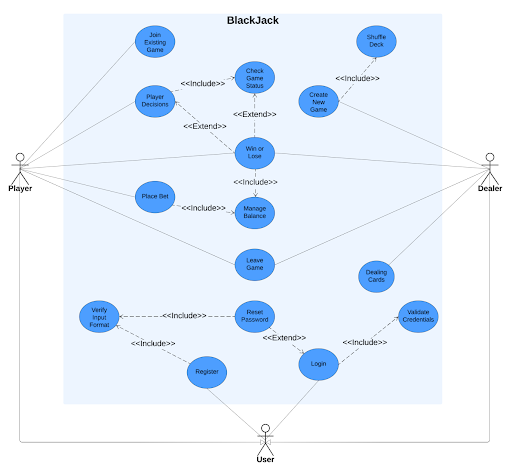
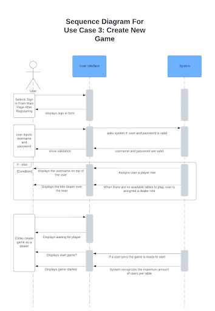
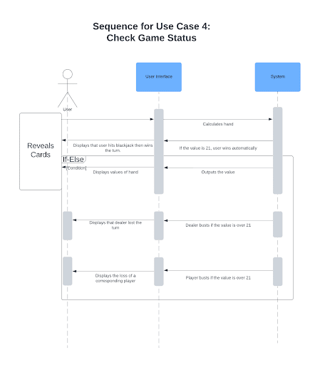
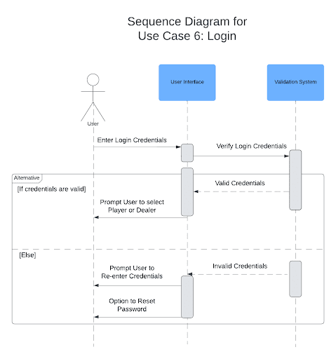
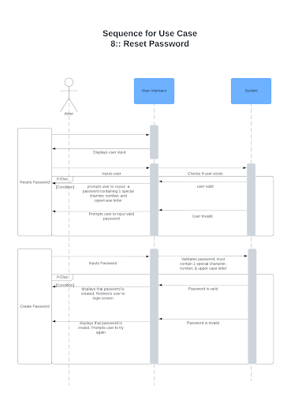
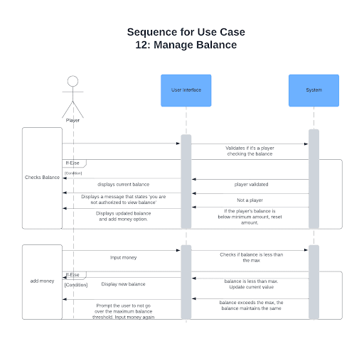

# 🖊️ Revision History

| Date         | Revision | Description                                                                                         | Author             |
|--------------|----------|-----------------------------------------------------------------------------------------------------|--------------------|
| `mm/dd/yy`   | `1.0`    | Initial Version                                                                                    |                    |
| `09/15/2024` | `1.1`    | Defined the acronyms and abbreviations                                                              | Neiyo Nakachi      |
| `09/24/2024` | `1.2`    | Updated Roles + began work                                                                          | All                |
| `09/24/2024` | `1.3`    | Working on Overall Description                                                                      | Victor Anguiano    |
| `09/24/2024` | `1.4`    | Began structure for Class Diagrams                                                                  | Victor Anguiano    |
| `09/24/2024` | `1.5`    | Listed out the common requirements, module requirements, external interface requirements            | Neiyo Nakachi      |
| `09/26/2024` | `1.6`    | Adding Use Cases                                                                                    | Carlos Escamilla   |
| `09/27/2024` | `1.7`    | Adding Use Cases                                                                                    | Carlos Escamilla   |
| `09/28/2024` | `1.8`    | Use Cases Finished; Beginning Use Case Diagram                                                      | Carlos Escamilla   |
| `09/28/2024` | `1.9`    | Adding Class Diagrams                                                                               | Zachary Dimalanta  |
| `09/29/2024` | `2.0`    | Completed Use Case Diagrams                                                                         | Carlos Escamilla   |
| `09/29/2024` | `2.1`    | Updated Non-Functional Requirements                                                                 | Victor Anguiano    |
| `09/29/2024` | `2.2`    | Updated Class Diagrams                                                                              | Zach & Carlos      |
| `10/01/2024` | `2.3`    | Formatting                                                                                          | Victor Anguiano    |
| `10/03/2024` | `2.4`    | Updates Based on Feedback                                                                           | Victor Anguiano    |

# 📋 Table Of Contents

# 1. Purpose
This document outlines the requirements for the Multiplayer BlackJack Game.

### **1.1** Scope
---
Hardware Requirements: Must have a system that can run Java applications, and has a stable internet connection.

This document will catalog the user, system, and hardware requirements for the Multiplayer BlackJack system. It will not, however, document how these requirements will be implemented.

### **1.2** Definitions, Acronyms, Abbreviations
---
**1.2.1.** **Ace**: This card can either be 1 or 11

**1.2.2.** **Blackjack**: Hand that consists of Ace and a 10- value card (10, Jack, Queen, or King)

**1.2.3.** **Hit**: To receive another card from the dealer to reach closer to 21

**1.2.4.** **Stand**: To keep your current hand, this ends your turn

**1.2.5.** **Double Down**: Double the original and receive one card from the dealer 

**1.2.6.** **Split**: Dividing a pair of cards with the same value into two separate hands, each hand has its own bet

**1.2.7.** **Scale**: Statistic in percentage to illustrate how strong your hand is 

**1.2.8.** **Bust**: When a player’s or dealer’s hand exceeds 21

**1.2.9.** **Dealer**: The person dealing and managing the cards. The dealer goes against everyone else

**1.2.10.** **Push**: A tie between your hand and the dealer;s hand, where it ends up in a draw and the bet is returned

**1.2.11.** **Insurance**: When the dealer’s face up card is an ace, you have the option to take a side bet to protect your original bet incase the dealer has a blackjack

### **1.3** References 
---
### Use Case 1: Register

#### References
- **Use Case Name**: Register

#### Relevant Requirements
- Username must be unique.
- Password must be at least 8 characters and contain special characters.

#### Primary Actor(s)
- User

#### Preconditions
- User interface is responsive.
- User-friendly interface available to navigate and create a user.

#### Postconditions
- A user is created with a valid username and password.
- User is returned to the start screen.
- User can sign in to the BlackJack game.

#### Basic Flow or Main Scenario
1. User navigates to the "Create User" button and selects it.
2. User inputs a unique, valid username.
3. User inputs a valid password with at least one special character, a number, and an uppercase letter.
4. User completes registration by clicking the "Register" button.
5. User is redirected to the start screen and prompted to sign in.

#### Extensions or Alternate Flows
- **Invalid Username or Password**:
  - If the user enters an invalid username or password, they are prompted to re-enter a valid one.

#### Exceptions
- User interface malfunctions.
- User loses connection to the game.

#### Related Use Cases
- **Starting a New Game**:
  - User will have valid credentials to log in and start a game.
- **Verify Input Format**:
  - System checks if the entered username and password meet the minimum requirements.
---
### Use Case 2: Verify Input Format

**Relevant Requirements:**  
- System checks to see if the username and password meet the requirements.

**Primary Actor(s):**  
- User

**Preconditions:**  
- User has attempted registration.
- Connection/interaction through TCP/IP is operating correctly.

**Postconditions:**  
- Username and Password are fully validated.
- User is registered to play Black Jack.

**Basic Flow or Main Scenario:**  
1. User attempts to register.
2. System checks the username is not taken.
3. System checks the password meets the appropriate requirements.

**Extensions or Alternate Flows:**  
- Username is taken.
- Password does not meet the requirements.
- User loses connection to the game.

**Exceptions:**  
- User loses connection to the game.

**Related Use Cases:**  
- **Registration**: User signs up with a valid username and password and is redirected to the start screen to log in.
---
### Use Case 3: Create New Game

**Relevant Requirements:**  
- User has created an account.
- Login functionality is working.
- Creates a new table if none are open and assigns the user the dealer title.

**Primary Actor(s):**  
- Dealer

**Preconditions:**  
- Connection/interaction through TCP/IP is operating correctly.
- User has an existing account.
- Player has enough balance to start a game.

**Postconditions:**  
- Dealer creates a new game.
- User is set as either Player.

**Basic Flow or Main Scenario:**  
1. User navigates to sign-in form seen on the user interface.
2. User inputs their credentials (username and password).
3. User is assigned the dealer title if no tables are available.
4. Dealer waits for players to join.
5. Game begins.

**Extensions or Alternate Flows:**  
- User inputs invalid username and password.
- User begins the game as the dealer.

**Exceptions:**  
- TCP/IP is not working, and connection to the game fails.

**Related Use Cases:**  
- **Winning or Losing**: Player can lose or gain money with every game instance.
- **Register**: User must have an account to sign in.

---
### Use Case 4: Check Game Status

**Relevant Requirements:**  
- Begins a game if the user has valid credentials.
- Dealer deals cards to players at the table.
- Ends game if player or dealer wins/loses.

**Primary Actor(s):**  
- Game System, Player, Dealer

**Preconditions:**  
- Game round is in progress.
- Both player and dealer have completed their turns.

**Postconditions:**  
- Player’s balance reflects their winnings or losses from the round.

**Basic Flow or Main Scenario:**  
1. Player and Dealer reveal their hands.
2. The winner/loser is determined.
3. Prompt table for next action.

**Extensions or Alternate Flows:**  
- Dealer busts (hand > 21), player wins automatically.
- Player busts (hand > 21), dealer wins automatically.
- Push (draw) condition, player’s bet is returned.

**Exceptions:**  
- Game connection error related to TCP/IP.
- Player bets more than their current balance.

**Related Use Cases:**  
- **Place Bet**: Deduct or distribute funds based on the game outcome.
- **Player Decisions**: Covers all moves a player can make during the game.

---
### Use Case 5: Place Bet

**Relevant Requirements:**  
- Player can place a bet that doesn’t exceed their balance.
- Game system updates player’s balance after placing a bet.

**Primary Actor(s):**  
- Player

**Preconditions:**  
- Player has sufficient funds.
- Player is validated through login.

**Postconditions:**  
- Dealer begins to deal cards.
- Player's balance is updated according to game outcome.

**Basic Flow or Main Scenario:**  
1. User logs in and joins a table with a dealer.
2. Player’s total funds are displayed.
3. Player places a bet.
4. Cards are dealt.
5. Player chooses to hit, stand, or double down.

**Extensions or Alternate Flows:**  
- Invalid Bet Amount: Player bets beyond balance, system rejects the bet.

**Exceptions:**  
- Connection error through TCP/IP.
- Session Timeout: Player takes too long to place an initial bet.

**Related Use Cases:**  
- **Join Existing Game**: Player validated with credentials.
- **Player Decisions**: Actions like hit, stand, double.

---
### Use Case 6: Login

**Relevant Requirements:**  
- User validated with username and password.
- Prompts user to register if username is not found.

**Primary Actor(s):**  
- User, Player, Dealer

**Preconditions:**  
- User has an existing account.
- User enters correct username and password.

**Postconditions:**  
- User assigned role of player or dealer.
- User prompted to join or create a new table.

**Basic Flow or Main Scenario:**  
1. User navigates to the sign-in form.
2. User enters valid credentials.
3. User prompted to join the game.
4. User assigned role as player or dealer.
5. Game begins.

**Extensions or Alternate Flows:**  
- Incorrect credentials entered; prompt to reenter.

**Exceptions:**  
- Game system connection lost.

**Related Use Cases:**  
- **Join Existing Game**: Player validated and joins a game.
- **Register**: User prompted to create an account if not registered.

---
### Use Case 7: Validate Credentials

**Relevant Requirements:**  
- System checks username and password exist.

**Primary Actor(s):**  
- System

**Preconditions:**  
- User has attempted to login.
- User has previously registered.

**Postconditions:**  
- User gains access to the game.

**Basic Flow or Main Scenario:**  
1. System validates username and password.
2. System provides feedback based on validation.

**Extensions or Alternate Flows:**  
- Username and password not found; prompt to register.

**Exceptions:**  
- Weak TCP/IP connection.

**Related Use Cases:**  
- **Login**: Validates user logging into the game system.

---
### Use Case 8: Reset Password

**Relevant Requirements:**  
- Prompt user to create a new password.

**Primary Actor(s):**  
- User

**Preconditions:**  
- User has an account.
- User has failed password entry 3 times.

**Postconditions:**  
- User’s password updated.

**Basic Flow or Main Scenario:**  
1. User navigates to the reset password link.
2. User enters username and new password.
3. User completes reset process and returns to login.

**Extensions or Alternate Flows:**  
- Invalid password input; form doesn’t submit.

**Exceptions:**  
- Connection error through TCP/IP.

**Related Use Cases:**  
- **Verify Input Format**: Validates new password requirements.
- **Login**: User logs in after password reset.

---
### Use Case 9: Dealing Cards

**Relevant Requirements:**  
- Shuffle deck, update hands, track remaining cards.

**Primary Actor(s):**  
- Player, Dealer, Game System

**Preconditions:**  
- Game contains at least one player and dealer.
- Initial bets placed.

**Postconditions:**  
- Hands and deck updated.

**Basic Flow or Main Scenario:**  
1. Deck is shuffled.
2. Initial bets placed.
3. System updates hands and determines winner/loser.

**Extensions or Alternate Flows:**  
- Not enough players to start game.

**Exceptions:**  
- Connection lost through TCP/IP.

**Related Use Cases:**  
- **Player Actions**: Player performs valid actions.
- **Winning or Losing**: Updates balance based on outcome.

---
### Use Case 10: Player Actions

**Relevant Requirements:**  
- Player can hit, stand, or double down.

**Primary Actor(s):**  
- Player

**Preconditions:**  
- Player places initial bet.

**Postconditions:**  
- Player’s balance updated based on action.

**Basic Flow or Main Scenario:**  
1. Player places bet.
2. Dealer deals two cards.
3. Player can hit, stand, or double down.

**Extensions or Alternate Flows:**  
- Player Hit: Dealer deals one card.
- Player Stand: Stops dealing cards.
- Player Double Down: Bet is doubled.

**Exceptions:**  
- Invalid action based on game flow.

**Related Use Cases:**  
- **Join Existing Game**: Player validated and joins a game.
- **Place Bet**: Player can place a valid bet.

---
### Use Case 11: Join Existing Game

**Relevant Requirements:**  
- Add player to a table with a dealer.

**Primary Actor(s):**  
- Player, System

**Preconditions:**  
- User logs in as a player.

**Postconditions:**  
- User begins the game.

**Basic Flow or Main Scenario:**  
1. User enters credentials.
2. System validates user.
3. User assigned as player, game begins.

**Exceptions:**  
- TCP/IP connection fails.

**Related Use Cases:**  
- **Login**: User logging into game system.

---
### Use Case 12: Manage Balance

**Relevant Requirements:**  
- Reset balance if below baseline.

**Primary Actor(s):**  
- Player, System

**Preconditions:**  
- System checks balance post-bet.

**Postconditions:**  
- Balance updated, bet deducted.

**Basic Flow or Main Scenario:**  
1. System checks player’s balance.
2. Balance updated or reset based on conditions.

**Extensions or Alternate Flows:**  
- Balance falls below minimum; reset balance.
---
### Use Case 13: Leave Game

**Relevant Requirements:**  
- Give the player/dealer the ability to exit the game.

**Primary Actor(s):**  
- Player, Dealer

**Preconditions:**  
- User is logged in as a player or dealer.
- There is a game in progress.

**Postconditions:**  
- Player/Dealer is taken back to the login screen.
- Player keeps their balance.

**Basic Flow or Main Scenario:**  
1. Player/Dealer selects the Leave Game button.
2. System redirects them to the login screen.
3. System prompts the user to start a new game if they wish.

**Extensions or Alternate Flows:**  
- Connection is weak, and the player/dealer is forced to quit.
- The connection the player/dealer has to the game is unstable.
- Game shuts down unexpectedly.

**Exceptions:**  
- Poor connection to the game.
- Player/Dealer accidentally selects the Leave Game option.

**Related Use Cases:**  
- **Verify Input Format**: System verifies that any new password meets the minimum requirements.
- **Login**: This use case covers the validation of the user logging into the game system.
---
### UML Use Case Diagram

---
### Sequence Diagrams for Use Cases

---

---

---

---

---

---

---

---

---

---

---

---

---

### 1.4 Overview
The Multiplayer BlackJack game is a Java program that is designed to allow multiple real-life players to host a game as a Dealer, or join a game by creating a BlackJack account to store and use money for betting against the Dealer. 

# 2. Overall Description
### **2.1** Product Perspective
The Multiplayer BlackJack system is designed to allow users to play blackjack games with multiple other (real) users over a TCP/IP connection. The system utilizes a client-server structure, where the server manages the creation and running of games, game logic, player interactions, and account management, while the client allows users to interact with the system via a GUI. Each client has to connect to the server individually in order to play in a real-time environment. 
The system must run on Java, with all communication between the server and clients handled using TCP/IP sockets to enable real-time connections/instances. It is independent of any existing software systems, databases, web components, or third-party frameworks; and it must run on any platform that supports Java with no further hardware or software requirements beyond being able to run the standard Java application.

---
### **2.1** Product Architecture
The system will be organized into 4 major modules:

**2.2.1.** Dealer module: Handles the dealer’s actions, which includes dealing cards, handling bets, and ensuring fairness. 

**2.2.2.** Player module: Handles player actions such as placing bets, hitting, standing, doubling down, and splitting hands.

**2.2.3.** Game module:  Handles core gameplay logic such as win/loss conditions, turn management, and ensuring players follow standard blackjack rules.

**2.2.4** Driver module: Handles the communication between the server and clients, ensuring a solid connection/interaction over TCP/ICP.

### **2.3** Product Functionality/Features 
The high-level features of the system are as follows (see section 3 of this document for more detailed requirements that address these features):

**2.3.1**. Account Management: Players can create and log into an account, and check their account balance and win/loss percentage.

**2.3.2.** Gameplay: Dealers can create a game of blackjack, regular players can join games of blackjack hosted by a dealer, all games are hosted in real-time, and players can perform standard blackjack actions (hit, stand, split, etc.).

**2.3.3.** Betting System: Players can place bets using personal funds and win or lose money based on the outcome of the game, and how much they bet and/or how they decided to bet (double down or split).

**2.3.4.** Dealer Actions: The dealer must follow pre-defined rules for managing the game, such as when they must hit or stand. 

**2.3.5.** Anti-Cheating: Procedures will be in place to minimize cheating and ensure fairness (Note: Counting cards and playing based on probabilities is not cheating).

### **2.4** Constraints

**2.4.1.** Since users may use any web browser to access the system, the system must run as a Java application, with no browser-specific code to be used in the system.

**2.4.2.** The system will only support TCP/IP protocol connections. 

**2.4.3.** The system must support fair gameplay, ensuring the dealer and players follow the rules of blackjack. 

**2.4.4.** The system must be able to handle multiple players and a dealer, and multiple simultaneous games in a real-time environment, without significant delays. 

### **2.5** Assumptions and Dependencies

**2.5.1.** It is assumed that the game will not start, nor continue, without a dealer present. 

**2.5.2.** It is assumed that no player’s funds may go below the minimum amount of $100. 

**2.5.3.** It is assumed that the system will support as many users as necessary. 

**2.5.4.** It is assumed that users will access the game from computers that meet the minimum hardware and software requirements for running Java applications. 

**2.5.5.** It is assumed that the players will have reliable network connections between the client and the server for seamless real-time gameplay. 

# 3. Specific Requirements
#### **3.1.1.** Common Requirements:
To create a user you will have to create a user name with a unique id. Every password should contain 1 special character, 1 number, and 1 uppercase letter. 

- #### **3.1.2** Card Ranking Module Requirements:
    - **Card Representation**: 
    - **Suits**: Symbols on the cards
    - **Values**: Numbers on the card are assigned values 
    - **Hand Calculations**: The value of your hand is determined by the sum of the suits and values of your cards. 

- #### **3.1.3** Player Module Requirements:s:
    - Attributes:
        - Username: Unique Username that identifies players 
         - Balance: Current balance will act as a rank
        - Profile: history of the wins and losses
        - Hands//
    - Methods: 
	    - Betting: Raises the bet
	    - Hitting: Dealer grants another card if the - value of your hand is too low
	    - Standing: When a user decides to keep their -  current hand 

- #### **3.1.4** Networking Module Requirements:
    - Client: 
     - To keep the game connected to the server 
     - User’s actions are sent to the server
     - Receives updates from the Server

- #### **3.1.5** Dealer Module Requirements:
    - Attributes:
	    - Hands: Represents the values in the dealer’s hands 
	    -  Action: The option for the dealer to stand, hit, or bust. 
    - Methods:
        - Deal: Deals the cards for everyone in the table
        - Hit: Gives themselves another card 
        - Stand: Maintains their current hand 
        - Bust: Exceeding hand value of 21 results in a bust 
- #### **3.1.6** Betting Module Requirements:
    Bets: Bets will start off as an initial bet and the rest is going to fall under the subsequent bets. There will also be a minimum bet that everyone has to meet if they want to participate. The bets need to be validated and make sure it doesn’t exceed the user’s current balance. The amount the user bet should deduct off their balance. 

- #### **3.1.7** New Game Module Requirements:
    - Player Count
    - Timer
    - Betting Pool
    - Start/End Round

#### **3.2.** External Interface Requirements:
Uses GUI for the following:
- #### **3.2.1.** Buttons for the actions 
- #### **3.2.2.** Cards
- #### **3.2.3.** Players
- #### **3.2.4.** Dealer
- #### **3.2.5.** Tables
- #### **3.2.6.** Text

#### **3.3** Internal Interface Requirements
- **3.3.1.** Unique Username and password are stored in one line in a text file. 
- **3.3.2.** Tracking of the game history
- **3.3.3.** Update of the balance
- **3.3.4.** Betting logic 
- **3.3.5.** Dealer/Player Logic 

---
# 4. Non-Functional Requirements

#### **4.1** Security and Privacy Requirements
- **4.1.1.** User sessions must automatically time out after a period of inactivity to prevent unauthorized access from unattended devices.
- **4.1.2.** The system must keep an encrypted activity log of all user actions, including login attempts and transactions, to enable monitoring for suspicious activity. 
- **4.1.3.** The system must restrict access to sensitive game server and user data, such as player balances and win/loss records through the use of access control lists. 

#### **4.2** Environmental Requirements
- **4.2.1.** The game needs to work with minimal issues across different platforms including mobile and desktop devices. 
- **4.2.2.** The game should have minimal delays over both Wi-Fi and cellular networks to maintain good performance amongst different players. 
- **4.2.3.** Game data must be backed up and saved regularly to prevent data loss in case of unexpected errors or system failure. 

#### **4.3** Performance Requirements
- **4.3.1.** The system must be able to handle an unlimited number of users without facing performance issues regarding connection or latency. 
- **4.3.2.** The game server must be able to process and update the state of a game based on user actions in real time. 
- **4.3.3.** The GUI must load within 5 seconds on a high-speed internet connection. 